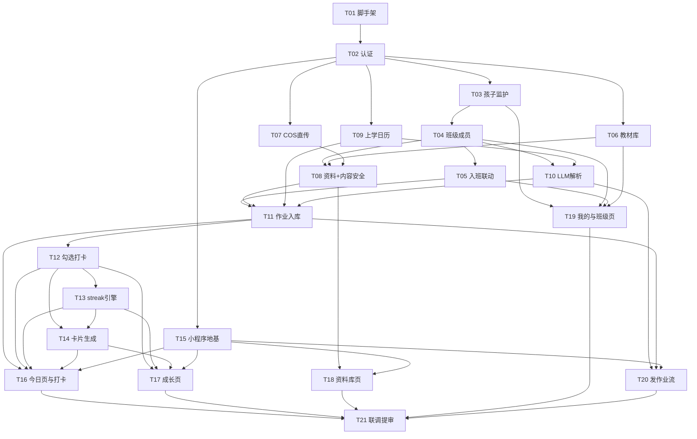

# v1 实施拆票

> 由 wayfinder v1 规格书（已关闭的地图）拆出。每张 ticket 开工前先读其"规格依据"；规格与本表冲突时以规格为准并回改本表。
> 后端：`backend/`（Go 1.22+ / chi 或 gin / GORM / MySQL 8，本地开发 `docker compose up mysql`）；小程序：`miniprogram/`（TS 模板已在）。阶段内无依赖的 ticket 可并行。

## M0 · 地基

### T01 后端脚手架与数据模型
- **交付**：Go module + `cmd/server`；配置加载（读根 `.env`）；GORM 连接 + 全表 AutoMigrate（`docs/design/data-model.md` 18 张表，含 `CheckinMedia`）；统一错误形状 `{"error","message"}`（错误码表见 `api-contract.md` §2）；`/api/v1` 路由骨架 + healthz；请求日志（含后续 LLM 结构化日志的字段约定）。
- **验收**：本地 MySQL 起服务，全部表建出；`GET /healthz` 200；未带 token 访问业务路由返回 401 `unauthorized` 形状正确。

### T02 认证中间件与用户
- **交付**：JWT RS256 本地验签中间件（白名单 iss、exp 必填、**aud 自校验**，公钥从 `AUTH_JWT_PUBLIC_KEY_URL` 拉取并缓存、支持本地文件 fallback——`research/001`）；`sub → users` 每请求首见 upsert；`GET /me`、`PATCH /me`；dev 签发测试 token 的命令行工具。
- **验收**：合法 token 建用户；过期/错 aud/错签名分别 401 `invalid_token`；工具签的 token 走通全链路。

## M1 · 家庭与班级

### T03 孩子与监护关系
- **交付**：`POST/GET /children`（创建者自动监护）、`PATCH /children/{id}`、监护人邀请（72h token）+ `POST /guardianships/accept`、移除/退出监护（409 `last_guardian`）——`api-contract.md` §3.1。
- **依赖**：T02。**验收**：两账号邀请-接受闭环；最后一个监护人不可移除。

### T04 班级与成员
- **交付**：建班（创建者=admin）、我的班级、公开班搜索、详情/修改、`POST /join-requests` 三分支（公开无审批→直接 member；公开有审批→pending；私密邀请码→绕过审批）、审批端点、成员列表/踢人（409 `member_has_children`、`admin_immutable`）/promote/demote（仅创建者）、退出、解散（409 `class_not_empty`、软删）、邀请码小程序码（`getUnlimitedQRCode`，scene=inviteCode，缓存）——§3.2。
- **依赖**：T02、T03（踢人需查孩子在班）。**验收**：三分支入班各走通；全部 409 分支有测试。

### T05 孩子入班与权限联动
- **交付**：`POST/DELETE /children/{id}/enrollments`、班内孩子名单；**入班→其全部监护人自动 member、退班→权限回收**（应用层在 enrollment 变更时重建 `class_members`，`data-model.md` 实现备忘）——§3.3。
- **依赖**：T03、T04。**验收**：监护人未入班时给孩子报班被拒；入班后自动获得 member；退班后孩子的勾选/打卡历史保留但不可见。

## M2 · 教材、媒体与内容安全

### T06 教材库
- **交付**：全局教材 CRUD（v1 无审核）+ 单元补充；班级按科目选用/查看——§3.4。
- **依赖**：T01。**验收**：建教材-选教材-换教材闭环。

### T07 媒体直传链路
- **交付**：STS `GetFederationToken`（session policy 收口 `uploads/*`）→ `POST /media/upload-tickets`（5 种 kind）→ cos-wx-sdk-v5 服务端配套的签名逻辑 → `POST .../confirm`（HEAD 校验，422 `upload_mismatch`）→ 每日孤儿清理任务——`research/003`、§3.5。
- **依赖**：T02。**验收**：服务端集成测试模拟直传+confirm 成功/失败两分支；临时密钥策略只覆盖 uploads/ 前缀。

### T08 学习资料与内容安全
- **交付**：微信 stable_token 集中缓存封装；`msgSecCheck` 同步薄封装；`mediaCheckAsync` + 消息推送回调端点 `POST /api/v1/wx/callback`（trace_id 幂等，配置在 launch-checklist §2）；资料 CRUD + 先审后显（pending/blocked 不可见）+ 预签名播放 URL（1~2h）——`research/002`、§3.6。
- **依赖**：T06、T07、T04。**验收**：文本同步拦截；媒体 pending→回调→pass 全链路（沙箱/模拟回调）；不可见性有测试。

## M3 · 作业核心

### T09 上学日历
- **交付**：`school_calendar` 表 + 2026–2027 种子导入脚本（`research/005`，`verified=false` 不驱动业务）；`GET /school-calendar`；**kind 判定工具**：给定日期→day/holiday（自动定位连续休息段的 start/end/name）——§3.9、`homework-parsing.md` §5.2。
- **依赖**：T01。**验收**：调休补班日判 day；国庆段判定出 8 天 holiday；未核验数据不参与判定。

### T10 LLM 作业解析
- **交付**：DeepSeek 客户端（JSON mode、30s 超时、温度参数、`DEEPSEEK_MODEL=deepseek-flash` / `DEEPSEEK_MODEL_HARD=deepseek-v4-pro`）；`go:embed` prompt（`parse_v1.md` 已在）；严格校验 + subject 归一（§3.4 全表）；失败分类 → 502 `llm_unavailable` / 422 `llm_parse_failed`；`POST /classes/{classId}/homework/parse`（含**已有 Session 探测**，回填 target/append 与 existingTodos）——`homework-parsing.md` §3、§5.3。
- **依赖**：T04、T09。**验收**：真实 key 跑混科文本出分组草稿；坏 JSON/空结果/超时各有路径测试。

### T11 作业入库与查询
- **交付**：`POST /classes/{classId}/homework` 单事务（msgSecCheck → 各分组判 kind → 冲突校验【追加/`duplicate_session` 指明科目/`no_homework_day_conflict`】→ 写 Session+Todos+notes+rawText）；`PATCH /homework/{id}`（todo id 不可变；remove 已勾级联清勾选）；`DELETE`（409 `session_has_checkins`）；班级视图 + **孩子当日聚合视图**（首页数据源，§3.7 ★）。
- **依赖**：T08、T09、T10。**验收**：混科一次入库多 Session；追加路径；并发同科整单 409。

## M4 · 勾选、打卡与进度

### T12 勾选与打卡
- **交付**：tick/untick（409 `todo_frozen`）；`POST .../checkin`（`{note?, media?: [{uploadId}]}` ≤9；409 `not_all_ticked` / `already_checked_in`、400 `future_date_forbidden`；补卡记实际日期）；`checkin_media` 逐附件过内容安全；打卡动态流（offset 分页，含附件预签名 URL 与卡片状态）——§3.8。
- **依赖**：T11。**验收**：未勾全拒绝；打卡后勾选冻结；重复打卡唯一约束兜底；补卡 checkin_date 正确。

### T13 streak 引擎与无作业日
- **交付**：打卡事务内 streak +1（同日同科目幂等、跨班同科合并）；惰性中断检测（读前检查过期未履约义务，履约义务定义见 `CONTEXT.md`）；每日校准任务；无作业日标记/撤销（当日 +1、撤销不回溯、409 冲突）；`GET /streaks`；**打卡日历端点**（每日 × 各科目 checked/missed/none + day kind）——`data-model.md` 履约规范、§3.9。
- **依赖**：T12。**验收**：`data-model.md` 操作影响矩阵 #6–8 的算例逐条过；ADR 0004 五条规则各有测试。

### T14 打卡卡片生成
- **交付**：gg 三模板按 `checkin-card.md` §3 坐标绘制（750×1000）；embed 三套 OFL 字体；seed=checkin.ID%3；鼓励语文案池；QR COS 缓存贴入（失败降级品牌名）；异步任务重试 3 次；`GET /checkins/{id}/card`（generating 轮询）。
- **依赖**：T12、T13（streak 事务后值）。**验收**：三种模板各出一张 PNG 与视觉稿比对；同 checkin 重试出同一张；todo 事后编辑不重绘历史卡。

## M5 · 小程序

### T15 小程序地基
- **交付**：token_exchange 登录 + refresh（X-ClientId，一次性轮换）封装；request 封装（错误形状、401 刷新重放、loading 约定）；**四 Tab 骨架 + 全局扁平化设计 token**（`ia.md` §4：通栏、发丝线、直角按钮、微信绿主色）；分科作业卡/勾选行等基础组件。
- **依赖**：T02。**验收**：真机登录拿到数据；四 Tab 空页可切换。

### T16 今日页与打卡
- **交付**：当日聚合渲染（分科卡、合计时长、"老师还提到"、无作业置灰行）；勾选交互；**打卡弹层**（chooseMedia 照片/视频混选 ≤9 → 走 T07 上传链路 → 确认端点）；打卡成功页 + 卡片轮询 + 保存/分享。
- **依赖**：T11、T12、T14、T15。**验收**：真机全流程：勾完→附 3 张照片+1 视频→打卡→卡片可保存。

### T17 成长页
- **交付**：单张全科目日历（周视图默认、箭头展开整月、●▲■◆ 符号、点日期筛选）；朋友圈式打卡动态（默认 3 条、滚动自动加载、媒体九宫格、播放/看图）；海报从动态进出。
- **依赖**：T13、T14、T15。**验收**：日期筛选/取消；自动加载不重复不丢条；视频真机可拖动进度。

### T18 资料库页
- **交付**：班级切换 → 科目教材 → 单元 → 资料列表；视频播放（预签名 URL）、图片全屏、文本页；未选教材引导。
- **依赖**：T08、T15。**验收**：视频真机 Range 拖动流畅；pending 资料不可见。

### T19 我的与班级管理页
- **交付**：我的（资料/孩子/班级行/邀请/设置）；班级列表与详情四页签（作业/资料/成员/教材）；孩子管理、监护人邀请（分享卡片入 accept）、加入班级（搜索/邀请码/扫码）。
- **依赖**：T03–T06、T15。**验收**：建班→邀请→入班→报孩子闭环真机走通。

### T20 发作业流（管理员）
- **交付**：粘贴页 → 解析 loading → **确认页**（分科分组、新建/追加标记、增删改序、改科目、老师还提到编辑、重解析/放弃/入库）→ 成功页；失败→重试→**手填页**（多行单科目）。
- **依赖**：T10、T11、T15。**验收**：混科文本一次发全；追加场景；断网/解析失败降级路径。

### T21 联调与提审
- **交付**：launch-checklist 回填（域名白名单、消息推送回调、类目）；节假日表人工核验置 verified；真机回归三条主流程；隐私话术与提审材料（fog 项：合规口径提审前过一遍）；体验版 → 审核。
- **依赖**：全部。**验收**：过审或拿到明确驳回原因。

## 建议排期

```
M0: T01 → T02
M1: T03 → T04 → T05          （T03 与 T06 可并行）
M2: T06→T07→T08               （T07 依赖 T02，可与 M1 并行）
M3: T09 → T10 → T11
M4: T12 → T13 → T14
M5: T15 → {T16, T17, T18, T19, T20} → T21
```

关键路径：T01 → T02 → T04 → T11 → T12 → T14 → T16。T09/T06/T07 是旁路，早做不阻塞别人。

## 依赖 DAG



关键路径（最长链，决定总工期）：**T01 → T02 → T03 → T04 → T10 → T11 → T12 → T13 → T14 → T16 → T21**。
